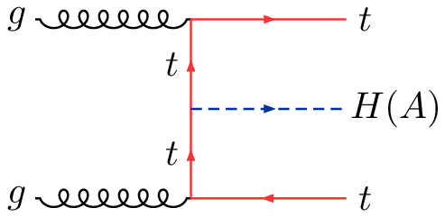
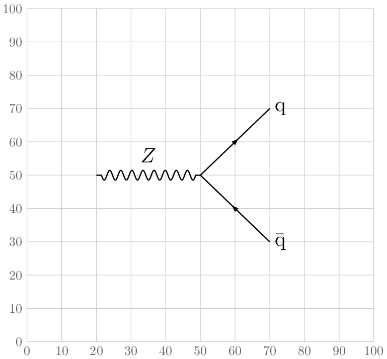

## pyfeyn

Draw Feynman diagrams with ROOT. Dependencies are pyROOT (`import ROOT` in either Python 2.7 or 3),
and having `pdflatex` and `pdfcrop` on your `$PATH`.

### Examples

The following diagrams come from `python examples.py`

| <!-- -->    | <!-- -->    | <!-- -->    |
|--------|--------|--------|
  |  
 |  |

The API is pretty simple. The `0-100` coordinate system can be optionally drawn with `draw_grid()`.

```python
import pyfeyn as pf

pf.init_diagram()
pf.draw_grid()

v_z = pf.Vertex(20, 50, label=pf.Label("Z", offsetx=-3))
v_zqq = pf.Vertex(50, 50)
v_q1 = pf.Vertex(70, 70, label=pf.Label(r"\mathrm{q}", offsetx=3))
v_q2 = pf.Vertex(70, 30, label=pf.Label(r"\bar{\mathrm{q}}", offsetx=3))

pf.Propagator(v_z, v_zqq, typ="wavyline").draw()
pf.Propagator(v_zqq, v_q1, typ="line").draw()
pf.Propagator(v_zqq, v_q2, typ="line", fliparrow=True).draw()

pf.save_diagram("feynmandiagram_zqq.pdf")
```


